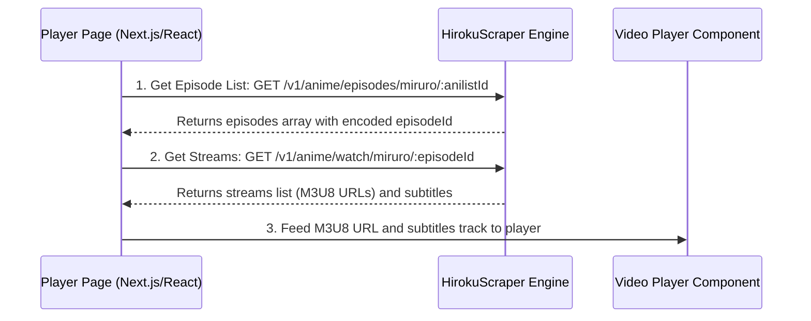

To fetch these endpoints into your frontend website (such as a Next.js/React player page), you will need to implement a data-fetching and playback flow. 

Here is how you can fetch and consume the scraper endpoints:

---

### 🔄 The Fetch & Playback Flow


---

### 🛠️ Step 1: Fetching Episodes & Selected Stream Data
In your Next.js player component, you will fetch the episodes and then load the streaming links when the user selects or plays an episode:

```typescript
import { useState, useEffect } from "react";

interface Episode {
  number: number;
  title: string;
  episodeId: string; // The encoded ID required to watch
}

interface StreamSource {
  url: string;
  isM3U8: boolean;
  quality: string;
  server: string;
}

interface Subtitle {
  lang: string;
  url: string;
  type: string;
}

const SCRAPER_BASE_URL = "http://localhost:3000/v1"; // Or your deployed Scraper URL
const API_KEY = "your_api_key_here"; // If config.apiKey is set

export default function AnimePlayer({ animeId }: { animeId: string }) {
  const [episodes, setEpisodes] = useState<Episode[]>([]);
  const [currentEpisode, setCurrentEpisode] = useState<Episode | null>(null);
  const [streamData, setStreamData] = useState<{ streams: StreamSource[]; subtitles: Subtitle[] } | null>(null);

  // 1. Fetch episodes on load
  useEffect(() => {
    async function loadEpisodes() {
      const res = await fetch(`${SCRAPER_BASE_URL}/anime/episodes/miruro/${animeId}`, {
        headers: { "Authorization": `Bearer ${API_KEY}` }
      });
      const json = await res.json();
      if (json.success) {
        setEpisodes(json.data);
        if (json.data.length > 0) {
          setCurrentEpisode(json.data[0]); // Default to Ep 1
        }
      }
    }
    loadEpisodes();
  }, [animeId]);

  // 2. Fetch watch links when currentEpisode changes
  useEffect(() => {
    if (!currentEpisode) return;

    async function loadStream() {
      // episodeId is already formatted as "provider|sub|rawId|anilistId|epNum"
      const res = await fetch(`${SCRAPER_BASE_URL}/anime/watch/miruro/${encodeURIComponent(currentEpisode.episodeId)}`, {
        headers: { "Authorization": `Bearer ${API_KEY}` }
      });
      const json = await res.json();
      if (json.success) {
        setStreamData(json.data); // data contains { streams, subtitles, intro, outro }
      }
    }
    loadStream();
  }, [currentEpisode]);

  // Render episodes list and player component here...
}
```

---

### 📺 Step 2: Integrating with a React Video Player
Once you have the stream URL (`streamData.streams[0].url`) and the subtitles, you can mount them in an HTML5 video player. Because the stream URLs return **HLS (.m3u8)** formats, you'll want to use `hls.js` or a wrapper like **Artplayer**, **Video.js**, or **Plyr**.

#### Option A: Using Vanilla HTML5 Video + `hls.js` (React Example)
```tsx
import { useEffect, useRef } from "react";
import Hls from "hls.js";

interface PlayerProps {
  src: string;
  subtitles: Subtitle[];
}

export function HlsPlayer({ src, subtitles }: PlayerProps) {
  const videoRef = useRef<HTMLVideoElement>(null);

  useEffect(() => {
    const video = videoRef.current;
    if (!video) return;

    if (Hls.isSupported()) {
      const hls = new Hls();
      hls.loadSource(src);
      hls.attachMedia(video);
      return () => hls.destroy();
    } else if (video.canPlayType("application/vnd.apple.mpegurl")) {
      // Fallback for native Safari HLS support
      video.src = src;
    }
  }, [src]);

  return (
    <video ref={videoRef} controls className="w-full h-auto aspect-video rounded-lg">
      {subtitles.map((sub, idx) => (
        <track
          key={idx}
          kind="subtitles"
          src={sub.url}
          srcLang={sub.lang.toLowerCase().slice(0, 2)}
          label={sub.lang}
          default={idx === 0}
        />
      ))}
    </video>
  );
}
```

---

### 🔒 Important Note on Security & CORS
The HLS manifest URLs returned by `watch` endpoint point back to your scraper (`/stream/manifest.m3u8?payload=...`). 
* Since the scraper server rewrites these tracks to route segments through itself, **ensure your Frontend domain is allowed in the Scraper's CORS configuration** (in [src/app.ts](file:///Users/feelzfilms03/Desktop/Code/hirokuScraper/src/app.ts)).
* The player will automatically load HLS files and subtitles cleanly without CORS blocking because the scraper handles CORS headers server-side.